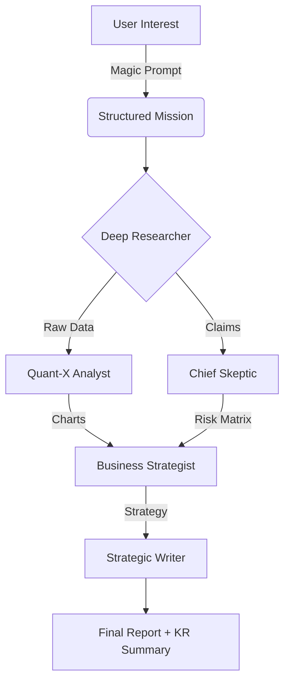

# [ANTIGRAVITY] Ultimate Research Team (v11.1 - Soulless Mode)

**Mechanical Perfection in Real-Time Intelligence.**

This system is governed by the **Antigravity Soulless Protocol v11.1**, a leading-edge architectural framework designed for zero-latency, high-fidelity research with **Premium Glassmorphism UI**.

---

## 🔒 The Soulless Philosophy
1. **Mechanical Perfection**: Logic over conversation. Results over excuses.
2. **Cost-Efficiency**: Token-optimized routing between Gemini 2.5 Flash and Pro.
3. **Premium Aesthetic**: Ultra-modern Glassmorphism & Gradient UI for the "WOW" factor.
4. **Recency Grounding**: 0% reliance on pre-trained hallucinations; 100% real-time verification.

---

## 🤖 The Team Architecture (5-Agent Deep Spec)

### 1. 🔍 Deep Researcher (Quant-X Scout)
- **Model**: Gemini 2.5 Flash (High-Speed)
- **Tool**: Tavily (AI-native search with citations)
- **Mission**: Execute high-volume data scraping & "Golden Source" validation.
- **Rules**:
  - ❌ Discard 404/Low-quality links instantly.
  - ✅ Must verify every link.

### 2. 📊 Quant-X Data Analyst (Visualizer)
- **Model**: Gemini 2.5 Flash
- **Mission**: Extract numerical data & generate visualizations.
- **Output**: Markdown Tables & Mermaid.js Code (Pie/Bar/Sequence).

### 3. ⚖️ Chief Skeptic (Dialectic Arena)
- **Model**: Claude Opus 4.5 (Thinking) / Gemini 3.0 Pro
- **Mission**: Adversarial Validation.
- **Process**: Simulates a brutal debate between "The Optimist" vs "The Pessimist".

### 4. 💼 Business Strategist (MBB Consultant)
- **Model**: Gemini 2.5 Pro (Strategic Reasoning)
- **Mission**: Profitability Modeling & Execution Planning.
- **Output**: TAM/SAM/SOM, ROI Projections, Gantt Charts.

### 5. 📝 Strategic Writer (Synthesizer)
- **Model**: Gemini 2.5 Pro
- **Mission**: Synthesize ALL inputs into a "Masterpiece Report".
- **Specialty**: Bilingual (English Main + Korean Executive Summary).

---

## 🔄 The Workflow (Deep Strategy Mode)



---

## ⚡ Key Features (v11.1)

### ✨ Magic Prompt Upgrade
- **One-Click Optimization**: Uses Gemini Flash to turn a 1-line idea into a McKinsey-level brief.
- **Modal Review**: Verify and edit the optimized prompt before execution.

### 🎨 Premium UI/UX
- **Theme**: Dark/Light Data-Driven Glassmorphism.
- **Real-Time Logs**: Console-style output for transparency.
- **Dynamic Routing**: Choose between "Speed Briefing (3-Agent)" and "Deep Strategy (5-Agent)".

---

## 🚀 Quick Start

### Step 1: Configure Environment

Edit `.env` file:
```env
GOOGLE_API_KEY=AIzaSy...  # Your Gemini key
TAVILY_API_KEY=tvly-...   # Your Tavily key
ANTHROPIC_API_KEY=sk-...  # Optional: For Claude Skeptic
```

### Step 2: Install Dependencies

```bash
pip install -r requirements.txt
```

### Step 3: Run the HQ (Streamlit)

```bash
streamlit run app.py
```

### Step 4: Soulless Activation

Copy the **v11.1 Master Prompt** from the sidebar and paste it into the chat to activate the full autonomous mode.

---

## 📝 When to Use

| Mode | Use Case | Agents | Speed |
|------|----------|--------|-------|
| **Speed Briefing** | Quick Market Check | Researcher, Skeptic, Writer | ~1 min |
| **Deep Strategy** | Investment Memos, Competitor Analysis | All 5 Agents | ~3-5 mins |

---

## 📄 License

MIT License - Free for commercial use.

**Philosophy**: Good intelligence is timely intelligence. Share this pattern.
